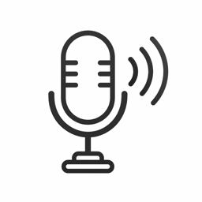

<p align="center">
  
</p>

<h1 align="center">YTT</h1>

<p align="center">
  Hold the fn key. Talk. Let go. Your words land at the cursor.<br>
  A tiny macOS menu bar app for push-to-talk dictation, fully offline.
</p>

---

YTT stands for Yap to Text. "Speech to text" sounded too formal for what
this is: you hold a key and yap, and text shows up.

The key is the one in the bottom-left corner of every Apple keyboard, labeled
`fn` with a small globe symbol. Apple calls it the Globe key in its settings;
this README calls it the fn key.

## What it does

- Hold the fn key anywhere on your Mac and speak. Release, and the text
  is pasted where your cursor is: TextEdit, a browser, a chat app, a terminal.
- Speech recognition runs on your machine with NVIDIA's Parakeet 0.6B model
  through [sherpa-onnx](https://github.com/k2-fsa/sherpa-onnx). Nothing leaves
  the Mac. A five second sentence comes back in about half a second.
- A small rules file cleans the result: a period at the end, a capital first
  letter, and a dictionary that fixes names the model keeps getting wrong.
  Those same names are also fed to the model as hotwords, so it hears them
  right in the first place.
- No dock icon, no window. One menu bar glyph that turns red while recording.

## How it works

```
fn down  ->  mic on (AVAudioEngine, 16 kHz mono)
fn up    ->  samples sent to a resident sherpa-onnx websocket server
            ->  cleanup rules  ->  pasteboard + Cmd+V  ->  pasteboard restored
```

The speech server is spawned once at launch and stays warm, so the 660 MB
model loads one time, not per dictation. The model itself is downloaded on
first run into `~/Library/Application Support/YTT/models/`.

## Requirements and what to expect

- macOS 13 or newer, Apple Silicon or Intel.
- Xcode Command Line Tools: run `xcode-select --install` if `swift --version`
  fails. No Xcode.app needed.
- A keyboard with a fn key. Every Apple keyboard has one.
- Disk: about 700 MB for the model, plus a 500 MB one-time download.
- RAM: 1.1 GB right after launch, up to 1.5 GB after a long dictation. The
  speech server stays resident so the model never reloads. On an 8 GB Mac
  that is a real slice of memory; on 16 GB or more you will not notice.
- English only. The bundled model is English-only Parakeet. Other sherpa-onnx
  models can be listed in `Resources/models.json`, but nothing else is tested.

Honest numbers, all measured on one machine, a MacBook Air with an M5 chip and
16 GB of RAM running macOS 26:

| What | Measured |
|---|---|
| Model load at launch | 1.3 to 1.6 s |
| 5 s of speech | text in about 0.5 s |
| 15 s of speech | about 1.2 s |
| 34 s of speech | about 2.5 s |
| Mic opens after the fn press | 130 to 250 ms (first word still intact) |

An Intel Mac will be slower, and an older Apple Silicon chip somewhat slower.
Expect a few misheard words per paragraph on names and jargon; that is what
the dictionary and hotwords are for. This is a personal tool built in a day,
tested on one Mac and one microphone. It works well there. Elsewhere, it is
untested.

## Install

There is no prebuilt download. You build it from source, which takes about a
minute after the first dependency fetch.

```sh
git clone https://github.com/r-fy/ytt.git
cd ytt
./build.sh
rm -rf /Applications/YTT.app && cp -R YTT.app /Applications/
open /Applications/YTT.app
```

Upgrading later: quit YTT from its menu bar icon first, then repeat the last
three lines. Replacing the app while it runs starts a second copy.

`build.sh` fetches sherpa-onnx 1.13.4 on first run (57 MB), builds both
architectures, bundles everything, and signs the app.

On first launch:

1. macOS asks for the Microphone. Allow it.
2. macOS asks for Accessibility. Click "Open System Settings", switch YTT on,
   then quit YTT from the menu bar icon and open it again. YTT needs this
   permission to see the fn key and to send the paste keystroke.
3. The menu bar icon shows a download arrow while the 500 MB model comes
   down (about a minute on a fast connection). When it turns into a
   microphone, you are ready.
4. YTT adds itself to your login items, so it is there after a restart.

Hold fn, say something, let go.

## Things to know

**The fn key's normal job is paused while YTT runs.** macOS normally uses
a tap on fn to open the emoji picker (or switch input source, or start
Apple's dictation). YTT sets that to "Do Nothing" while it runs and puts your setting
back when it quits. If YTT ever crashes and the fn key stays dead, set it
back by hand in System Settings > Keyboard > "Press globe key to".

**Other apps that grab the fn key must be quit.** Two apps fighting over
the same setting is how you end up with a dead fn key.

**Every rebuild resets the Accessibility permission**, because macOS ties the
grant to the app's signature and ad-hoc signing makes a new one each time.
If you plan to rebuild often, create a personal signing certificate once and
`build.sh` will use it automatically. Full commands are in
[docs/signing.md](docs/signing.md).

**Clipboard managers will see every dictation.** The text goes through the
pasteboard, and a manager like Maccy records it like any other copy. YTT
puts the previous pasteboard contents back about a third of a second after
the paste. That is best effort: if another app writes the pasteboard inside
that window, YTT leaves it alone and the dictated text stays on it.

**The paste goes to the app that was in front when you released the key.**
If you switch apps during the half second of transcription, YTT skips the
paste and leaves the text on the pasteboard for a manual Cmd+V, instead of
typing into whatever you switched to.

**Your dictations are kept on disk, in plain text.** `history.jsonl` in the
data folder has every dictation (raw and cleaned, with the app name and
time), and `last.wav` has the audio of the most recent one. Nothing is sent
anywhere, but anyone with access to your user account can read those files.
Delete them whenever you like; YTT recreates them.

**The speech server listens on a local port** (127.0.0.1 only, random port
per launch). Only programs on your own Mac can reach it. If YTT is force
quit or crashes, it kills any leftover server on the next launch.

**Taps under a quarter second are ignored**, so a stray press does not paste
anything.

**Recordings cap at two minutes.** A stuck key will not record forever.

**Login item.** YTT registers itself to start at login. Remove it under
System Settings > General > Login Items if you would rather launch it by hand.

**Apple Silicon or Intel** both work. `build.sh` makes a universal binary.

## Cleanup rules

Rules live in a plain JSON file you can edit by hand. Pick "Edit cleanup
rules" from the menu bar icon. Changes apply on the next dictation, no
restart. Every rule has an on/off switch:

```json
"rules": {
  "dictionary": true,
  "spaceBeforeCurrency": true,
  "capitalizeFirst": true,
  "terminalPunctuation": true,
  "questionMark": true,
  "hotwords": true
}
```

Dictionary entries give the correct spelling and, optionally, the wrong ones
to replace. Add your own name and the products or people you say often:

```json
{ "to": "Jane Doe", "from": ["jane dough", "jane do"] },
{ "to": "GitHub", "from": ["get hub", "git hub"] }
```

Every `to` is also sent to the speech model as a hotword, which biases the
model toward that spelling before any cleanup runs. Adding one needs a
relaunch for the model side; the find-replace side is instant.

## Sharing rules across Macs

By default the rules and history live in `~/Library/Application Support/YTT`.
To share them through a synced folder (iCloud Drive, Syncthing, Dropbox):

```sh
defaults write local.ytt.menubar dataDir "$HOME/Sync/YTT"
```

then relaunch YTT.

## Files it writes

| Path | What |
|---|---|
| `~/Library/Application Support/YTT/models/` | the speech model |
| `~/Library/Application Support/YTT/last.wav` | audio of the last dictation, for debugging |
| `~/Library/Application Support/YTT/hotwords.txt`, `bpe.vocab` | derived files for the speech server, regenerated at launch |
| `~/Library/Logs/YTT.log` | timings, state changes, errors (no transcript text) |
| `<data folder>/rules.json` | cleanup rules |
| `<data folder>/history.jsonl` | one line per dictation: time, app, raw text, cleaned text |

## Uninstall

1. Quit YTT from the menu bar icon. This puts the fn key's normal action back.
2. `rm -rf /Applications/YTT.app`
3. Remove YTT from System Settings > General > Login Items if it is still listed.
4. Delete the data: `~/Library/Application Support/YTT` (model, audio, rules,
   history) and `~/Library/Logs/YTT.log`. If you pointed `dataDir` at a synced
   folder, delete `rules.json` and `history.jsonl` there too.
5. Check System Settings > Keyboard > "Press globe key to" shows the action
   you want.

## Project layout

```
Sources/YTT/
  AppDelegate.swift          wiring, permissions, login item
  GlobeKeyListener.swift     fn down/up via a global event monitor
  GlobeSystemAction.swift    holds the system fn-tap action at "Do Nothing" while running
  AudioRecorder.swift        mic capture to 16 kHz float32
  SherpaProcess.swift        spawns and supervises the speech server
  SherpaWebSocketEngine.swift  one binary message per dictation
  Hotwords.swift             hotword list and BPE vocab for the server
  ModelStore.swift           manifest, download, extract, install marker
  TextInjector.swift         pasteboard + Cmd+V, restore afterwards
  StatusBarController.swift  menu bar icon and menu
  DataDir.swift              where rules.json and history.jsonl live
  History.swift              dictation history
  Cleanup/                   rules engine and the cleanup pipeline
spike/                       the standalone experiments each phase started as
tools/                       fetch-sherpa.sh, check-rules.sh
```

`STATUS.md` has the running state and the gotchas learned while building.

## Credits

- fn key handling and the paste keystroke timing come from
  [OpenWhispr](https://github.com/openwhispr/openwhispr) (MIT), stripped down
  and ported into the app.
- Speech: [sherpa-onnx](https://github.com/k2-fsa/sherpa-onnx) running
  NVIDIA's Parakeet TDT 0.6B v3.
- Icon generated with gpt-image-2.

## License

MIT for the code in this repository. Model and engine keep their own licenses.
